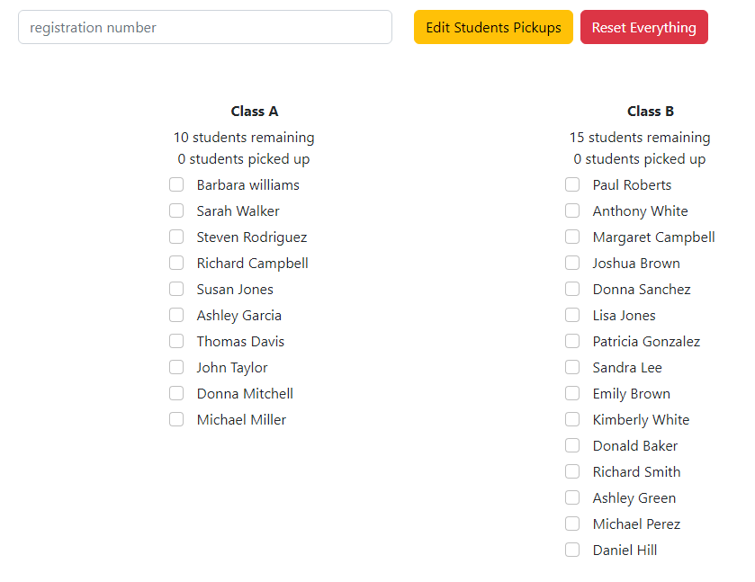
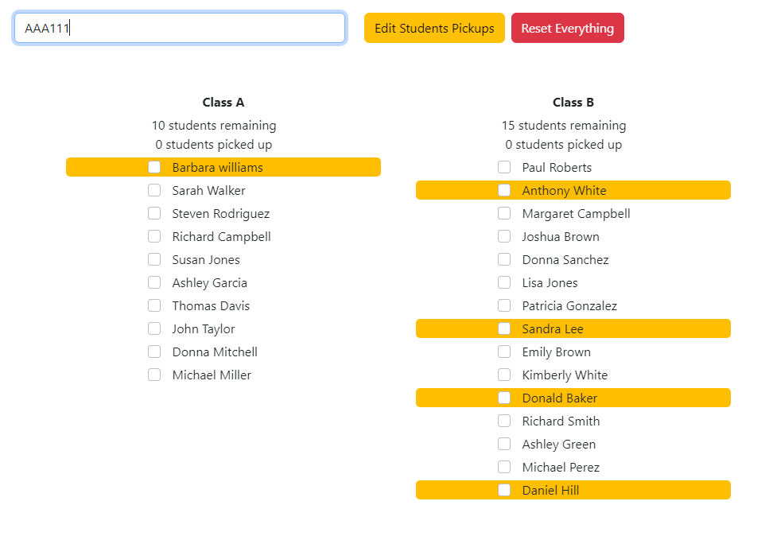
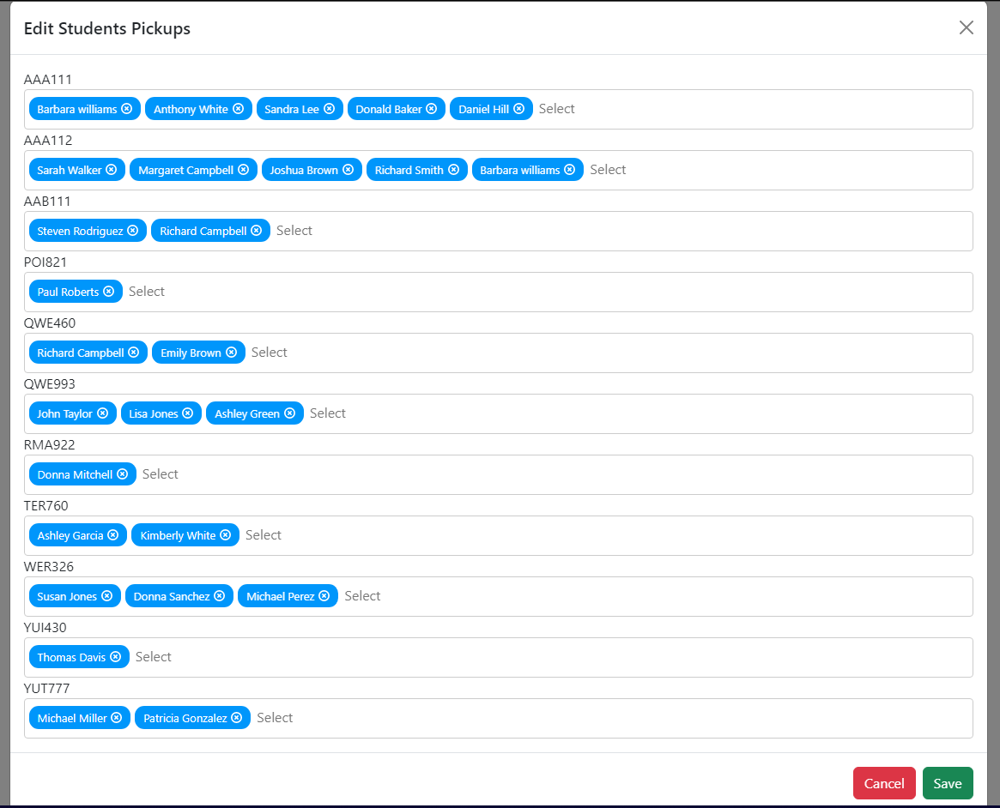
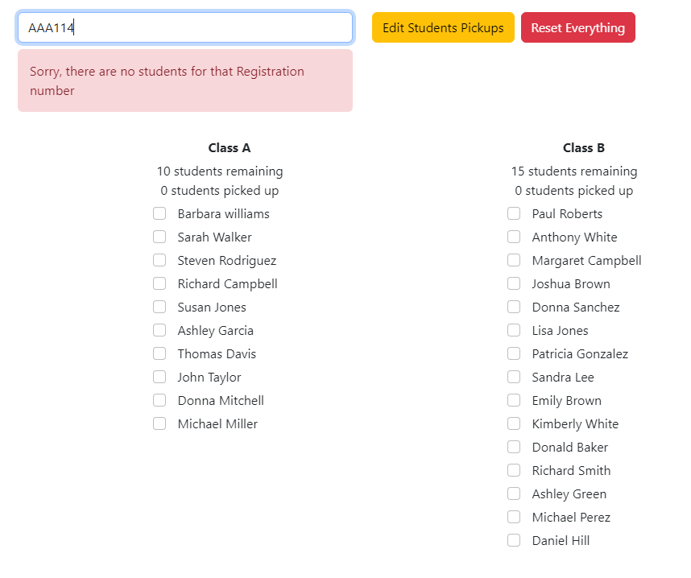

# Classroom Pickup [](https://opensource.org/licenses/MIT)

## Description
Type a registration ('AAA111' ex.) into the registration input and tick off the students. Hosted on https://classroom-pickup.herokuapp.com/

## Table of Contents
- [Technologies used](#technologies-used)

- [Installation](#installation)

- [Tests](#tests)

- [Usage](#usage)

- [License](#license)

## Technologies used
### Front-end
- React.js
- multiselect-react-dropdown

### Back-end
- MySQL
- Node.js
- Sequelize
- concurrently
- dotenv
- express

## Installation
To install the necessary dependencies, run the following command:

```

npm i

```

## Tests
Sorry, no tests currently at this point

## Usage
Requires mySQL

- Create a new file at location `./server/` and name it .env

- Copy contents below to the file:

```

DB_NAME='classroom_db'

DB_USER='[user]'

DB_PASSWORD='[password]'

```

- Run schema.sql file in the db to create the classwoom_db database:

- type `mysql -u root -p` into cmd at ./server/db folder location

- Type your password

- type source ./schema.sql

- exit

- open cmd at base folder location

- Type `npm run seed` to seed the db with hardcoded data

- Type `npm run develop` to start development server









## License
This project is licensed under the [MIT](https://opensource.org/licenses/MIT) license
